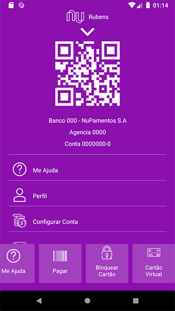

# Tela Nubank App :smiley:

Tela de apresentação do nubank, o projeto basicamente é para recriar a interface do nubank.  
Você pode baixar o projeto e contribuir. npm install  :+1:  
O projeto se encontra todo na pasta src, nesta pasta temos as pastas, assets que contem imagens, a pasta components
que contem os componentes que estamos utilizando e a pages que contem a pagina principal.  
Cada arquivo tem seu style separado.  
Ainda esta faltando o a primeira tela, para finalizarmos. 👊

 
 

<h2>Como esta a tela</h2>

